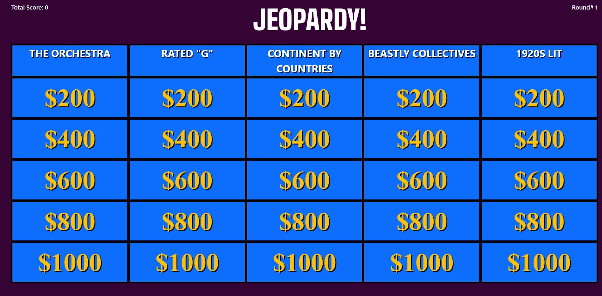
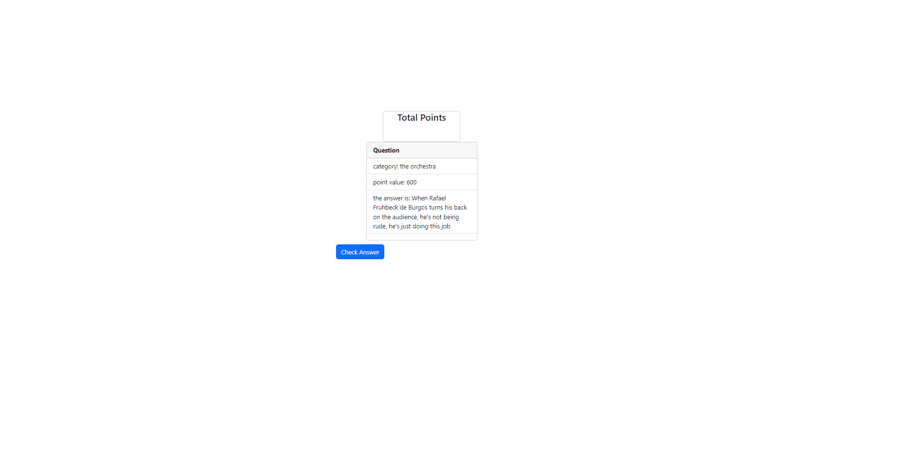
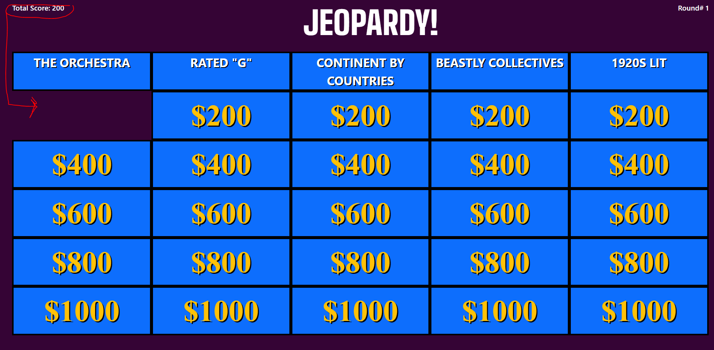
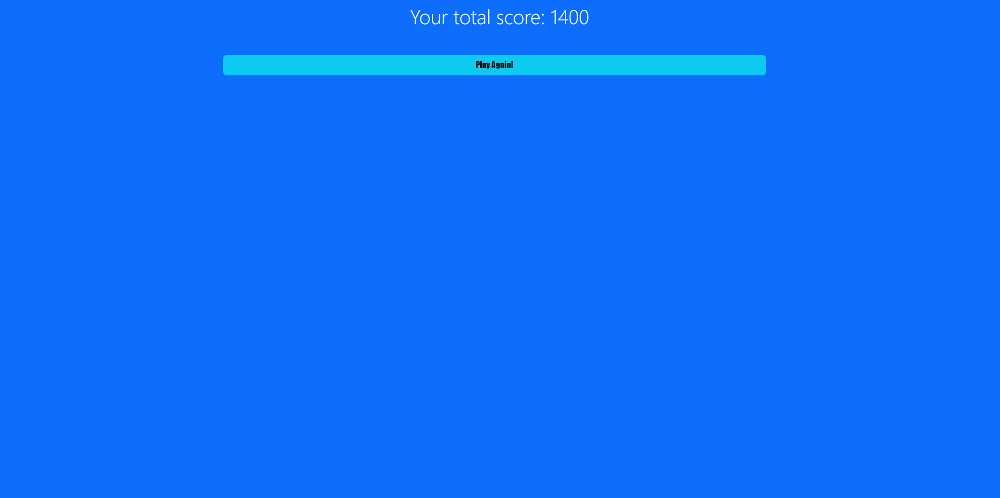

# Jeopardy-Quiz-Game
## Description

Welcome to the Jeopardy Quiz Game Application! This application allows users to play a Jeopardy-based trivia quiz game by selecting categories and answering questions to earn points. The game fetches random categories and questions from the [jservice.io](https://jservice.io/) API and provides an interactive webpage for users to play.

## Features

- Fetches random categories and questions from the [jservice.io](https://jservice.io/) API.
- Displays category titles on the gameboard.
- Allows users to select categories and answer questions to earn points.
- Stores user's total score in local storage.

## Usage

1. First, to access the application, you will need to go to the landing page, which can be located here >> https://kevalpatel6.github.io/Jeopardy/

2.Upon clicking through the landing page, you will be presented with instructions on how to play. After clicking through the instructions page, you will see a gameboard with categories displayed.

3.If there are enough random categories stored in local storage, the game will display these categories. Otherwise, it will fetch random categories from the API.

Below is a screen shot of the gameboard.

4.Click on a category question to select it. (money values below the categories)

5.Once a category is selected, the game will fetch questions related to that category from the API and display them.

Below is a screen shot of the question page.

6.Answer the question before checking your answer. You will need to manually decided whether your answer was correct or incorrect. Your score will be updated based on your correct answers.

7.The total score is displayed at the top of the gameboard.

Below you can see a screen shot of an answered question with the total score updated at the top of the screen. 

8. After all the questions have been answered, you will be redirected to the end page where you can decided if you want to play again. 

Below you can see a screen shot of the end page. 

9.Enjoy the quiz and challenge yourself to earn the highest score!

## Credits

Keval Patel - https://github.com/KevalPatel6 
Jason Navon - https://github.com/godot23 
John Doaks - https://github.com/jtdoaks

Special thanks to our instructor Dane Edwards on helping us with the async await and our TAs Andrew Layendecker and Justyn Subrai for helping with local storage issues. 

If you used any third-party assets that require attribution, list the creators with links to their primary web presence in this section.

## License
Permission is hereby granted, free of charge, to any person obtaining a copy of this software and associated documentation files (the "Software"), to deal in the Software without restriction, including without limitation the rights to use, copy, modify, merge, publish, distribute, sublicense, and/or sell copies of the Software, and to permit persons to whom the Software is furnished to do so, subject to the following conditions:
[Full License Text: https://opensource.org/licenses/MIT]

